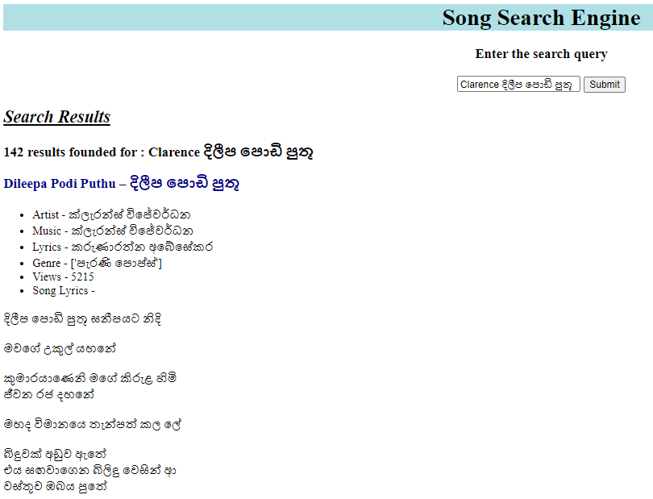
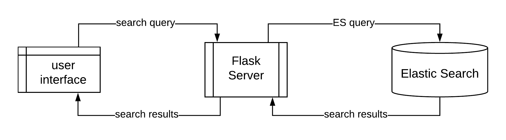
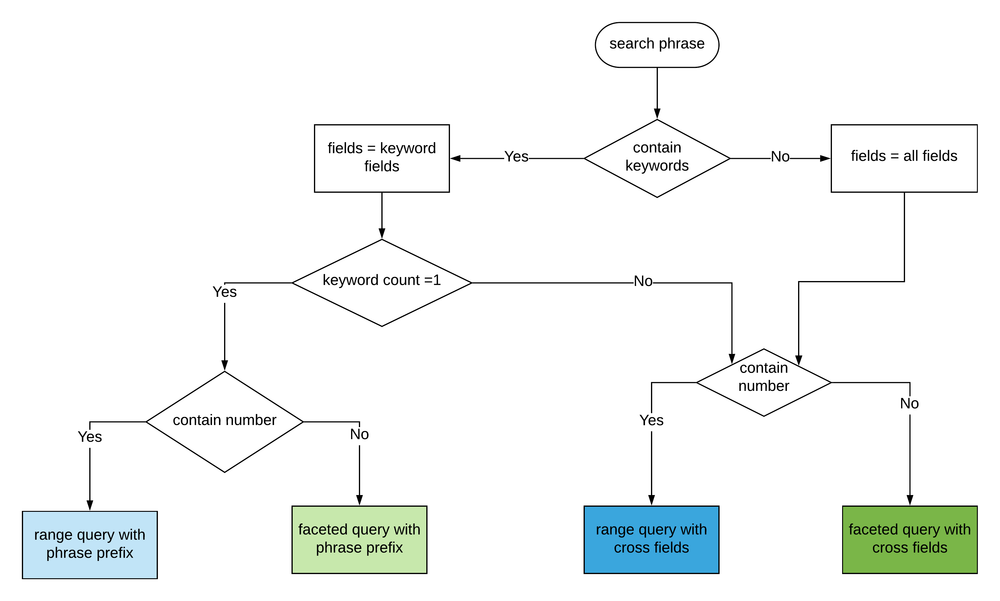

pyt# IR_Project-Song_Search_Engine
Song Search Engine using ElasticSearch and Python for IR Project(CS4642)

## Getting Start
### Setting up the Environment
* Download and Install the _ElasticSearch_
* Install the _ICU_Tokenizer_ plugin on the ElasticSearch
* Install the _python3_ with _pip3_
* Install the python packages in the _requirements.txt_

### Running the Project
1. First start the ElasticSearch locally on port 9200.
2. Then run **_index_creation.py_** file to create the index and insert data.
3. Next run the **_main.py_** to start the search engine
4. Then visit http://localhost:5000/ for see the user interface.
5. Finally add your search query in the search box for searching.

## File Structure
* song_scraper - Folder contains python codes used for scrape data
* data - Folder contains both scraped data and translatd data with python code used for translation
* templates - Folder contains Html user interface of the search engine
* documents - Folder contains project proposal & project report
* images - Folder contains diagrams used in README.md
* index_creation.py - Python code for index creating and data inserting
* search_function.py - Python code use for process search query
* advanced_queries.py - Elastic Search queries
* requirements.txt - python requirements 

## Details of Song Data
translated_songs.json file contains 987 Sinhala Songs with the following data.
1. title - Song title in both Sinhala and English languages
2. song_lyrics - Song lyrics in Sinhala
3. views - View count of the song
4. sinhala_artist - Singer's name in Sinhala
5. sinhala_lyrics - Lyricist's name in Sinhala
6. sinhala_music - Musician's name in Sinhala
7. sinhala_genre - Song type in Sinhala
8. english_artist - Singer's name in English
9. english_lyrics - Lyricist's name in English
10. english_music - Musician's name in English
11. english_genre - Song type in English

## Basic Functionalities
* It supports searching by the title, artist
name, writer name, composer name, or using the part of the lyrics.(Faceted Query)
> eg : රිද්ම කුවේණියේ, Akuru Maki Nehe – අකුරු මැකී නෑ,  රන් ටිකිරි සිනා
* Search Engine can identify ranges given in the search query and sort by view count(Range Queries)
> eg : අමරදේව ගැයු හොඳම සින්දු 10
* Search Engine can identify synonyms related to specific fields like ගයපු(artist), ලියපු(lyricist), සංගීත(music) and search
based on the identified fields
> eg : ගුණදාස කපුගේ ගයපු සින්දු, ලුෂන් බුලත්සිංහල ලියූ සින්දු, එච්.එම්. ජයවර්ධන සංගීතවත් කල ගී
* Search Engine supports both Sinhala and English Language queries (Bilingual Support)
> eg : songs sang by gunadhasa kapuge - ගුණදාස කපුගේ ගයපු සින්දු
* Search Engine also support to the query phrases which is a mix of Sinhala and English languages.
> eg : Clarence දිලීප පොඩි පුතූ

Following figure shows the example search result of the UI.

## Project Architecture

Following figure shows how the search engine works through the flask server.

## Indexing & Query techniques

### Indexing
* 'ICU_Tokenizer’ which is a standard tokenizer and which has better support for Asian languages to tokenize text into the words. 
* Elastic search ‘edge_ngram’ filter was used to generate n-grams. 

### MultiSearch with Rule Base classification
Rule-based text mining is used to understand and extract data from the user entered query
string. 

A basic set of rules are applied to each search phrase to identify the keywords, classify them into relevant search types. Acoording to the classification user query was classified to one of the following query type.
    
    1.Range query with Cross Fields
    2.Faceted query with Cross Fields
    3.Range query with phrase-prefix
    4.Faceted query with phrase-prefix
    
Follwing diagram further shows the use of Rule Based Classification and Multisearch queries.

